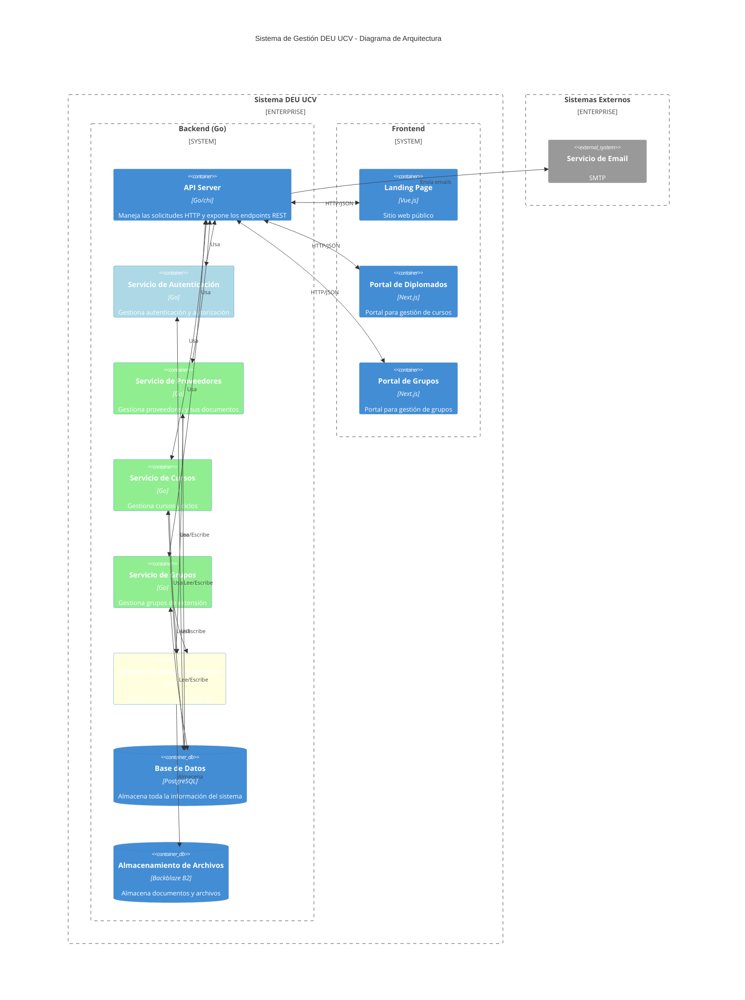

# Arquitectura del Sistema DEU UCV

## Diagrama de Arquitectura

## Descripción de Componentes

### Backend (Go)
- **API Server**: Punto de entrada principal que maneja todas las solicitudes HTTP y expone los endpoints REST.
- **Servicio de Autenticación**: Gestiona la autenticación y autorización de usuarios.
- **Servicio de Proveedores**: Maneja la lógica de negocio relacionada con proveedores y sus documentos.
- **Servicio de Cursos**: Gestiona la lógica de negocio relacionada con cursos y ciclos.
- **Servicio de Grupos**: Maneja la lógica de negocio relacionada con grupos de extensión.
- **Servicio de Almacenamiento**: Interfaz unificada para el manejo de archivos usando Backblaze B2.

### Frontend
- **Landing Page**: Sitio web público implementado en Vue.js.
- **Portal de Diplomados**: Aplicación Next.js para la gestión de cursos.
- **Portal de Grupos**: Aplicación Next.js para la gestión de grupos de extensión.

### Almacenamiento
- **PostgreSQL**: Base de datos principal que almacena toda la información del sistema.
- **Backblaze B2**: Servicio de almacenamiento en la nube para documentos y archivos.

### Sistemas Externos
- **Servicio de Email**: Sistema externo para el envío de correos electrónicos.

## Flujo de Datos

1. Los clientes (frontend) interactúan con el sistema a través de la API REST.
2. El API Server autentica las solicitudes y las direcciona al servicio correspondiente.
3. Los servicios procesan las solicitudes, interactuando con la base de datos y el almacenamiento según sea necesario.
4. Los archivos se almacenan en Backblaze B2 a través del servicio de almacenamiento.
5. Las notificaciones se envían a través del servicio de email externo.