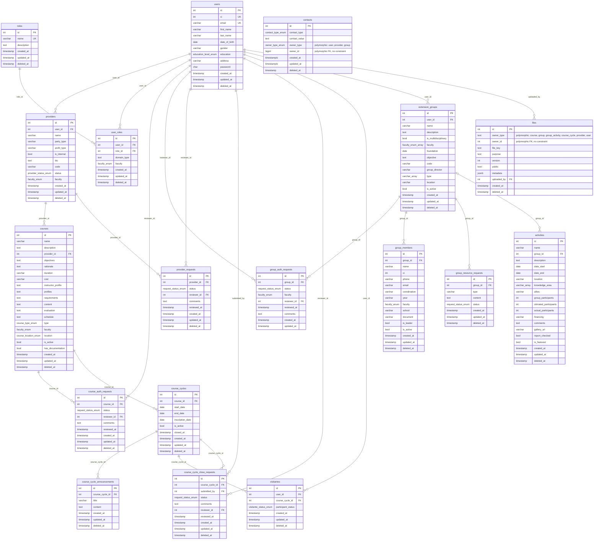

# DEU UCV — Diagrama Entidad-Relación

Generado a partir de las migraciones en `postgresql/migrations/`. Esquema: `deu`.

> Nota: `contacts` y `files` usan relaciones polimórficas (`owner_type` + `owner_id`), no FKs reales — se muestran como comentario, no como líneas de relación.
>
> Nota: si vas a visualizar este diagrama, evita mermaid.live — su motor de layout tiende a fallar en diagramas grandes como este y su función de auto-reparación puede sobrescribir el archivo con una versión mutilada. Usa la extensión "Mermaid" de VS Code, `mmdc` (mermaid-cli) local, o el archivo `docs/schema.dbml` en dbdiagram.io.

## Notas

- **Relaciones polimórficas**: `contacts.owner_id`/`owner_type` y `files.owner_id`/`owner_type` no tienen FK real en la base de datos; pueden apuntar a `users`, `providers`, `extension_groups`, `courses`, `course_cycles`, o actividades de grupo según el tipo.
- **Soft deletes**: la mayoría de las tablas tienen `deleted_at` para borrado lógico.
- **Enums definidos**: `education_level_enum`, `faculty_enum`, `provider_status_enum`, `course_location_enum`, `course_type_enum`, `request_status_enum`, `visitante_status_enum`, `contact_type_enum`, `owner_type_enum`.
- `activities.group_id` permite `NULL` (ON DELETE SET NULL), por eso la relación con `extension_groups` es opcional (`|o--o{`).
- Este mismo esquema también está disponible como `docs/schema.dbml` para dbdiagram.io, que maneja mejor diagramas grandes que mermaid.live.
